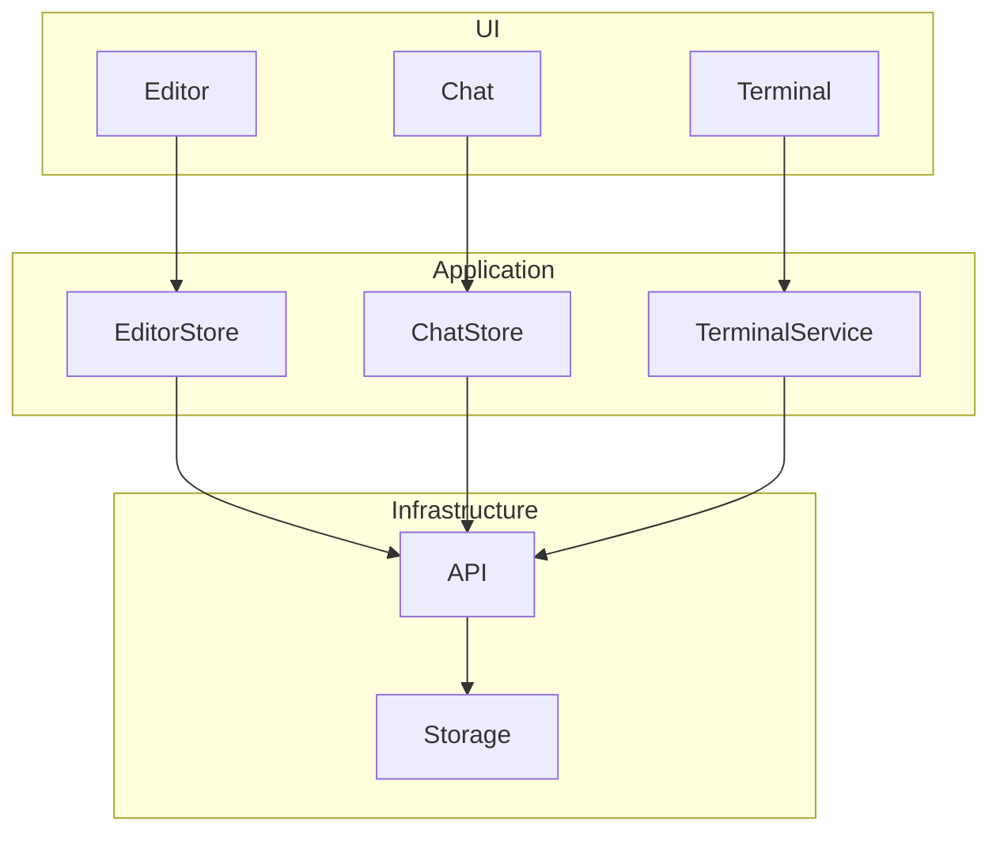
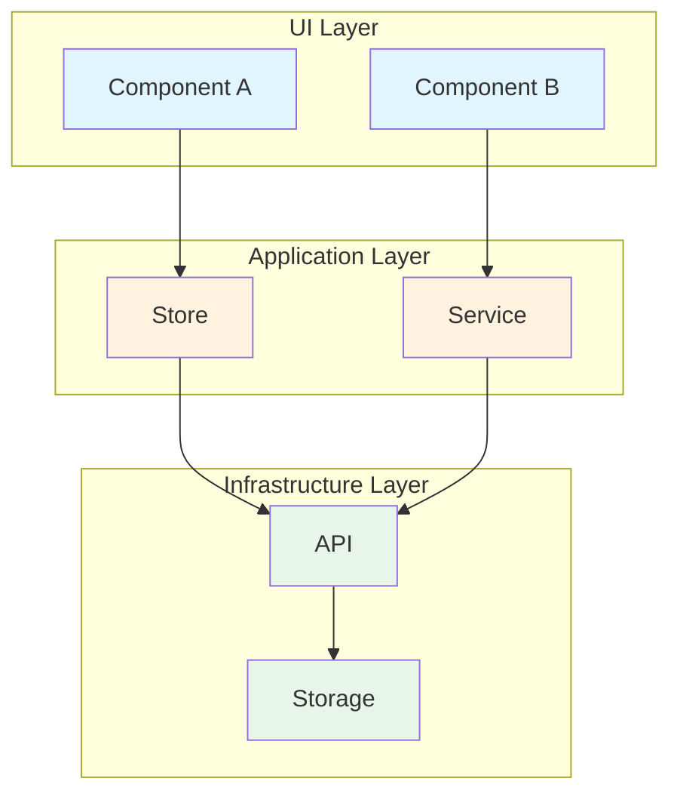

# Architecture Analysis Methods

Analyze system architecture, module boundaries, and dependency relationships.

## Analysis Flow

```
Layer Identification → Module Boundary Analysis → Dependency Analysis → Coupling Assessment → Output Architecture Diagram
```

---

## 1. Layer Identification

### Standard Layering Model

```
┌─────────────────────────────────────────┐
│              UI Layer                    │
│  (Components, Pages, Views)              │
├─────────────────────────────────────────┤
│          Application Layer               │
│  (State Management, Business Logic,      │
│   Services)                              │
├─────────────────────────────────────────┤
│         Infrastructure Layer             │
│  (API, Storage, Utilities, External      │
│   Services)                              │
├─────────────────────────────────────────┤
│             Core Layer                   │
│  (Type Definitions, Constants, Pure      │
│   Functions)                             │
└─────────────────────────────────────────┘
```

### Identification Methods

```bash
# Identify UI layer
rg "React|Component|render|return.*<" --type tsx

# Identify Application layer
rg "useState|useStore|Service|Manager" --type ts

# Identify Infrastructure layer
rg "invoke|fetch|localStorage|IndexedDB" --type ts

# Identify Core layer
rg "^export (interface|type|const)" --type ts
```

### Output Format

```markdown
## Layer Identification

| Layer | Directory | Responsibility |
|-------|-----------|----------------|
| UI | src/tools/ | Feature components |
| UI | src/features/ | Feature modules |
| Application | src/*/store/ | State management |
| Application | src/*/services/ | Business services |
| Infrastructure | src/infrastructure/api/ | API calls |
| Core | src/shared/types/ | Type definitions |
```

---

## 2. Module Boundary Analysis

### Identify Modules

```bash
# Find module entry files
fd "index.ts|mod.rs" --type f

# Find module exports
rg "^export \{|^pub mod|^pub use" 
```

### Assess Boundary Clarity

**Clear boundary characteristics**:
- Has explicit index.ts / mod.rs as public API
- Internal implementations not directly referenced externally
- Communicates through interfaces rather than concrete types

**Blurry boundary characteristics**:
- External directly references internal files
- Cross-module concrete type dependencies exist
- No explicit public API

### Check Methods

```bash
# Check for cross-module internal references
# Normal: from '@/module/index' or from '@/module'
# Problem: from '@/module/internal/file'
rg "from ['\"].*/(internal|impl|private)/" --type ts
```

---

## 3. Dependency Analysis

### Import Analysis

```bash
# Analyze file dependencies
rg "^import |^from " [target_file]

# Analyze who depends on module
rg "from ['\"].*target_module" --type ts -l

# Count dependency frequency
rg "from ['\"]@/" --type ts | cut -d'"' -f2 | sort | uniq -c | sort -rn
```

### Dependency Direction Check

```bash
# Check for references violating dependency direction
# Core should not depend on upper layers
rg "from ['\"].*(components|services|stores)" core/

# Infrastructure should not depend on UI
rg "from ['\"].*components" infrastructure/
```

### Circular Dependency Detection

```bash
# If A imports B and B imports A, circular dependency exists
# Check module A's dependencies
rg "from ['\"].*moduleB" moduleA/

# Check if module B reversely depends on A
rg "from ['\"].*moduleA" moduleB/
```

### Visualization Format



---

## 4. Coupling Assessment

### Metrics

| Metric | Calculation Method | Threshold |
|--------|-------------------|-----------|
| Inward Coupling | How many modules reference it | >10 needs attention |
| Outward Coupling | How many modules it references | >15 needs attention |
| Circular Dependencies | How many cycles exist | >0 needs fix |
| Cross-layer Dependencies | References violating layering | >0 needs fix |

### High Coupling Module Identification

```bash
# Most referenced modules (core modules, modify carefully)
rg "from ['\"]" --type ts -o | sort | uniq -c | sort -rn | head -20

# Files with most imports (may have too many responsibilities)
for f in $(fd ".ts$"); do
  count=$(rg "^import" $f | wc -l)
  echo "$count $f"
done | sort -rn | head -20
```

---

## 5. Output Architecture Diagram

### Mermaid Architecture Diagram Template



---

## Architecture Analysis Report Template

```markdown
# Architecture Analysis Report

## Overview
- Analysis Date: YYYY-MM-DD
- Analysis Scope: [Project/Module]

## Layering Structure
[Layer identification table]

## Module List
| Module | Path | Responsibility | Boundary Clarity |
|--------|------|----------------|------------------|
| ... | ... | ... | Clear/Blurry |

## Dependency Relationships
[Dependency diagram Mermaid]

## Coupling Assessment
| Module | Inward | Outward | Assessment |
|--------|--------|---------|------------|
| ... | ... | ... | Normal/Too High |

## Problem Discovery
- [ ] Circular dependency: A ↔ B
- [ ] Cross-layer dependency: Core → UI
- [ ] Excessive coupling: Module X referenced 20+ times

## Target Architecture
[Target architecture diagram Mermaid]

## Refactoring Path
1. Step 1
2. Step 2
```
