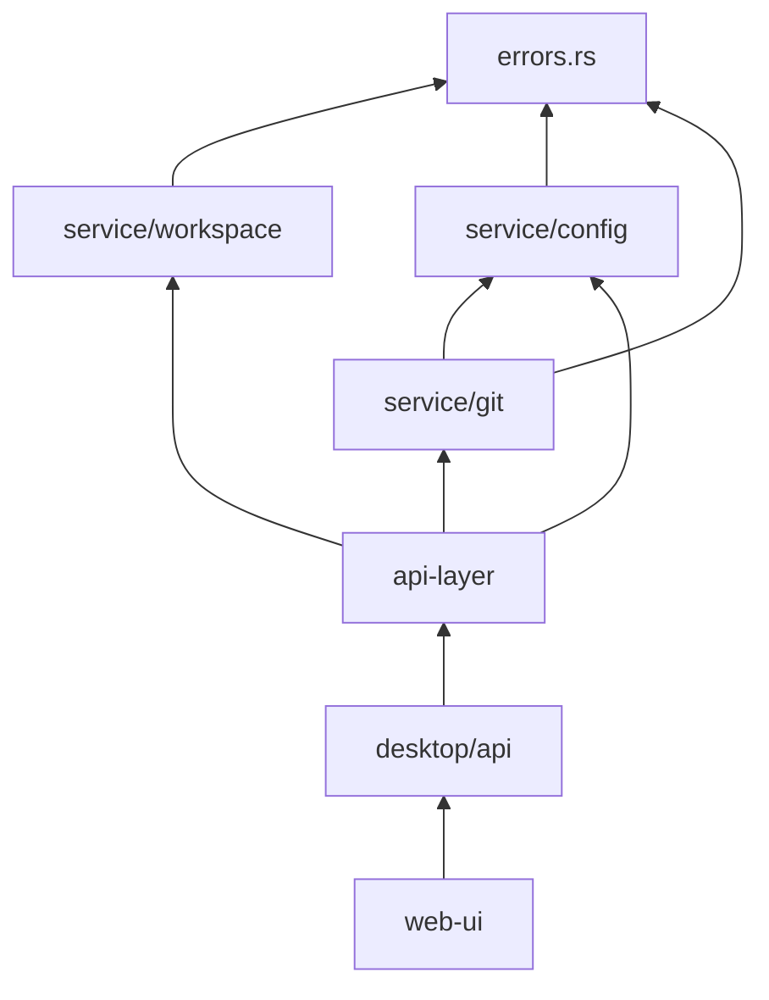

# Dependency Sorting Methods

Perform dependency analysis and sorting on logic refactoring tasks to determine execution order.

## Core Principle

```
Tasks with no dependencies first, tasks most depended on first
```

---

## Analysis Flow

```
1. List all involved modules
2. Build dependency graph
3. Detect circular dependencies
4. Topological sort
5. Generate execution plan
```

---

## 1. List Involved Modules

### Method

```bash
# Search for patterns that need modification (using error handling as example)
rg "anyhow::|AppError|Result<.*Error>" --type rust -l

# Search for API calls that need unification
rg "invoke\(|fetch\(" --type ts -l

# List involved directories
rg "target_pattern" --type ts -l | xargs dirname | sort -u
```

### Output

```
Involved module list:
├── crates/core/util/errors.rs
├── crates/core/service/workspace/
├── crates/core/service/config/
├── crates/core/service/git/
├── crates/api-layer/
├── apps/desktop/src/api/
└── packages/web-ui/infrastructure/
```

---

## 2. Build Dependency Graph

### Analyze Each Module's Dependencies

```bash
# What modules does module A depend on
rg "^use |^from " moduleA/ | grep -E "modB|modC|modD"

# Which modules depend on module A
rg "use .*moduleA|from .*moduleA" --type rust --type ts -l
```

### Build Adjacency List

```
Dependency relationships (A → B means A depends on B):

errors.rs: []                    # No dependencies
service/workspace: [errors]      # Depends on errors
service/config: [errors]         # Depends on errors
service/git: [errors, config]    # Depends on errors and config
api-layer: [service/*]           # Depends on all services
desktop/api: [api-layer]         # Depends on api-layer
web-ui: [desktop/api]            # Depends on desktop/api
```

### Visualization



---

## 3. Detect Circular Dependencies

### Method

```python
# Pseudocode: DFS detect cycle
def has_cycle(graph):
    visited = set()
    rec_stack = set()
    
    def dfs(node):
        visited.add(node)
        rec_stack.add(node)
        
        for neighbor in graph[node]:
            if neighbor not in visited:
                if dfs(neighbor):
                    return True
            elif neighbor in rec_stack:
                return True  # Cycle found
        
        rec_stack.remove(node)
        return False
    
    for node in graph:
        if node not in visited:
            if dfs(node):
                return True
    return False
```

### Handle Circular Dependencies

```
If circular dependency A ↔ B found:

Option 1: Decouple first
  - Extract common part to new module C
  - A → C, B → C
  - Then refactor A and B separately

Option 2: Merge handling
  - Treat A and B as one task
  - Modify together, verify together

Option 3: Introduce interface layer
  - Create interface module I
  - A → I, B → I
  - I contains abstract definitions
```

---

## 4. Topological Sort

### Algorithm (Kahn's Algorithm)

```
1. Calculate in-degree (dependency count) for each node
2. Add nodes with in-degree 0 to queue
3. Take node from queue, add to result
4. Decrease in-degree of node's neighbors by 1
5. If neighbor's in-degree becomes 0, add to queue
6. Repeat until queue is empty
```

### Example Execution

```
Initial in-degrees:
errors: 0      ← In-degree 0, process first
workspace: 1
config: 1
git: 2
api-layer: 3
desktop: 1
web-ui: 1

Sort result:
Level 1: errors           (in-degree 0)
Level 2: workspace, config (in-degree becomes 0)
Level 3: git              (in-degree becomes 0)
Level 4: api-layer        (in-degree becomes 0)
Level 5: desktop          (in-degree becomes 0)
Level 6: web-ui           (in-degree becomes 0)
```

---

## 5. Generate Execution Plan

### Phase Division Rules

```
Modules at same Level can be in same Phase (parallel)
But need to consider:
- Task scale (avoid single Phase too large)
- Verification complexity (easier problem isolation)
- Logical relevance (related modules together)
```

### Example Execution Plan

```markdown
## Execution Plan: Unify Error Handling

### Phase 1: Core Definition
- task-001: errors.rs error type unification
- Verify: cargo check crates/core
- Checkpoint: Core definition complete

### Phase 2: Service Layer (Parallel)
- task-002: service/workspace migration
- task-003: service/config migration
- Verify: cargo check crates/core
- Checkpoint: Service layer base complete

### Phase 3: Service Layer (Depends on previous two)
- task-004: service/git migration
- Verify: cargo check crates/core
- Checkpoint: Service layer complete

### Phase 4: API Layer
- task-005: api-layer migration
- Verify: cargo check --workspace
- Checkpoint: API layer complete

### Phase 5: Application Layer
- task-006: desktop/api migration
- Verify: cargo check apps/desktop
- Checkpoint: Backend complete

### Phase 6: Frontend
- task-007: web-ui/infrastructure migration
- Verify: npm run build
- Checkpoint: All complete
```

---

## Utility Functions

### Quick Analyze Dependency Depth

```bash
# Calculate how many times a module is depended on (importance)
for mod in $(ls modules/); do
  count=$(rg "from .*$mod|use .*$mod" -l | wc -l)
  echo "$count $mod"
done | sort -rn
```

### Generate Dependency Matrix

```bash
# Output CSV format dependency matrix
echo "module,depends_on"
for mod in $(ls modules/); do
  deps=$(rg "^import|^use" modules/$mod/ | grep -oE "modules/\w+" | sort -u | tr '\n' ';')
  echo "$mod,$deps"
done
```
