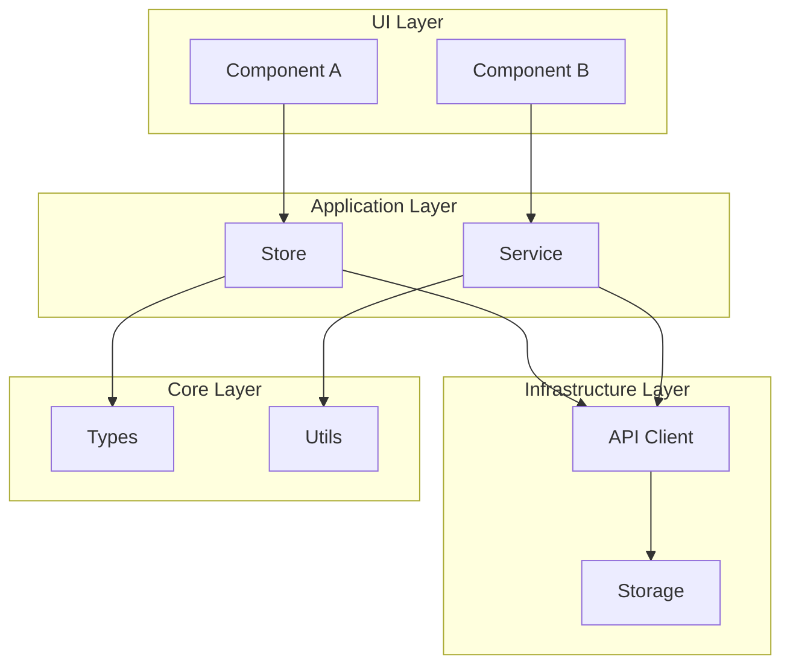
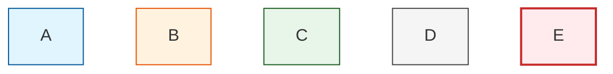
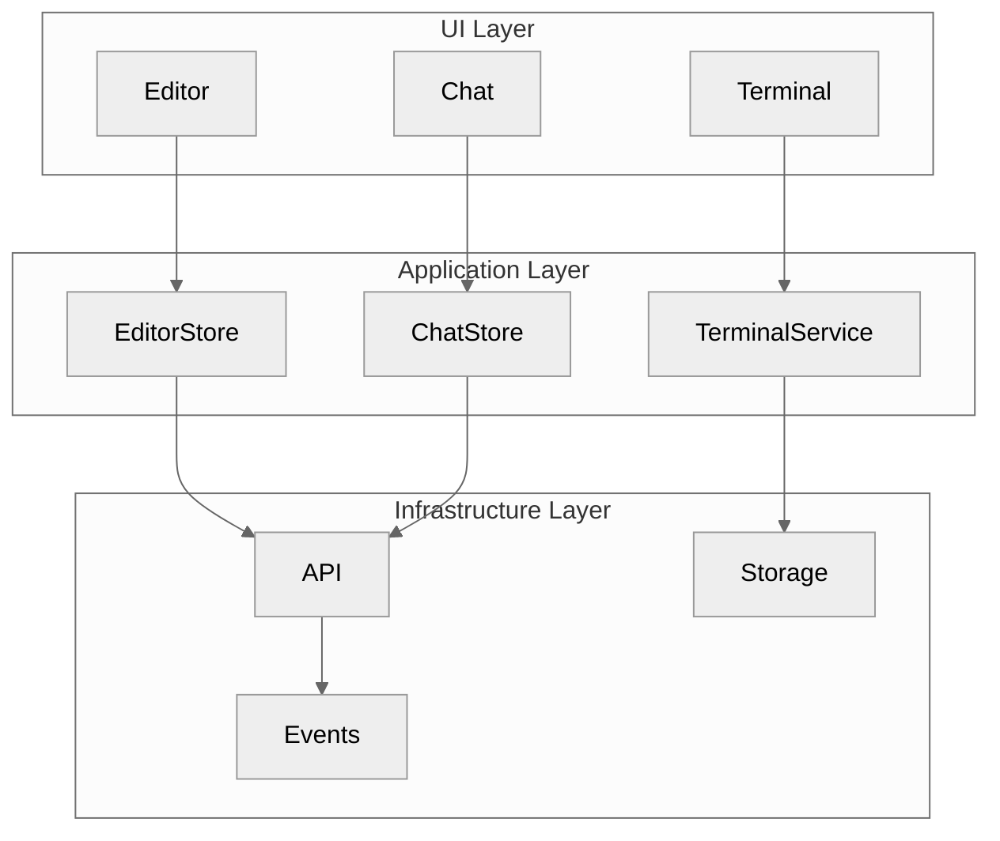
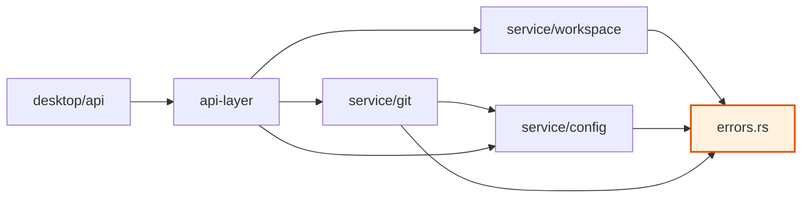
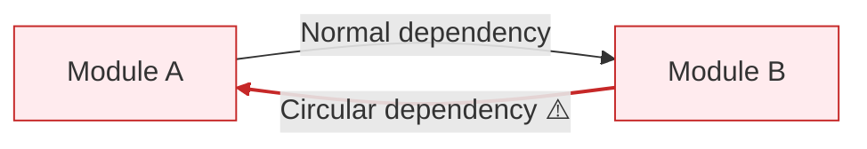
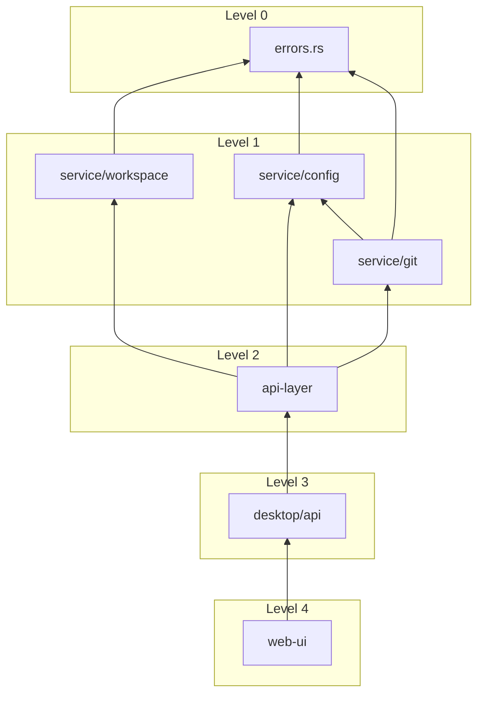
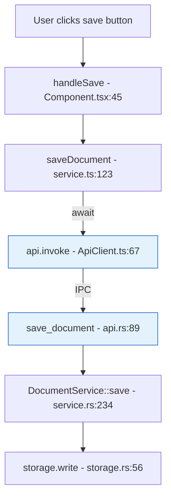
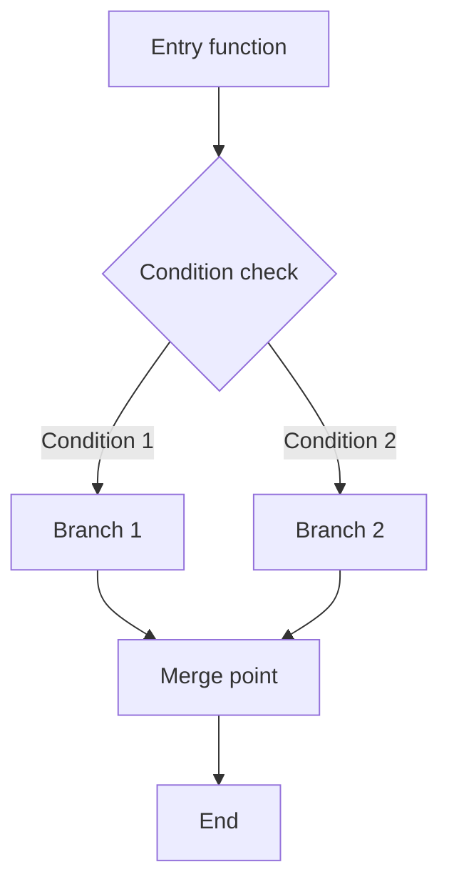
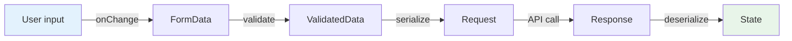
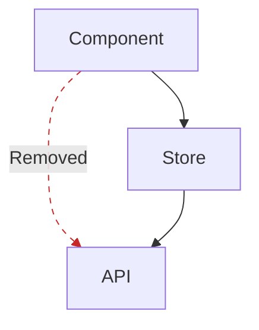

# Diagram Conventions

Specifications for using Mermaid to draw architecture diagrams, dependency diagrams, and call stack diagrams.

## General Conventions

### File Format

- Extension: `.mermaid`
- Encoding: UTF-8
- Location: `.refactor/diagrams/`

### Naming Rules

```
{type}-{description}.mermaid

Examples:
architecture-current.mermaid
architecture-target.mermaid
dependency-api-layer.mermaid
callstack-save-document.mermaid
```

---

## Architecture Diagrams

### Layered Architecture



### Style Specifications



### Template



---

## Dependency Diagrams

### Module Dependencies



### Circular Dependency Annotation



### Dependency Levels



---

## Call Stack Diagrams

### Vertical Flow



### Flow with Branches



---

## Data Flow Diagrams



---

## Before/After Comparison Diagrams

### Side-by-Side Comparison

```markdown
## Architecture Comparison

### Before

​```mermaid
graph TB
    A[Component] --> B[Store]
    A --> C[API]  %% Direct API call
    B --> C
​```

### After

​```mermaid
graph TB
    A[Component] --> B[Store]
    B --> C[API]  %% Only through Store
​```
```

### Change Annotation



---

## Embedding Diagrams

### Embed in Markdown

```markdown
## Architecture Analysis

Current architecture:

​```mermaid
graph TB
    A --> B
    B --> C
​```

Issues:
- A directly depends on C, crossing layers
```

### Reference External Files

```markdown
## Architecture Analysis

Current architecture: [Architecture Diagram](../diagrams/architecture/current.mermaid)

Target architecture: [Target Architecture Diagram](../diagrams/architecture/target.mermaid)
```

---

## Common Icons

```
✅ Complete/Normal
⚠️ Warning/Attention
❌ Error/Problem
🔄 In Progress
⏳ Waiting
📦 Module
📄 File
🔗 Dependency
```
