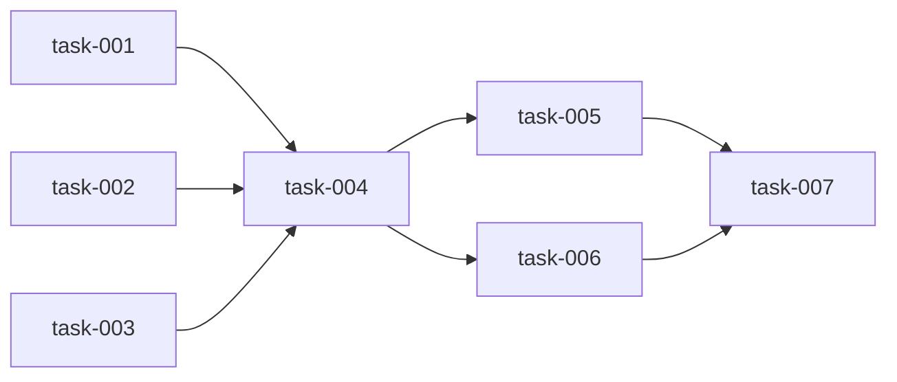

# Master Plan Template

Copy this template to `.refactor/tasks/master-plan.md` for use.

---

```markdown
---
project: {project name}
created: {creation date}
updated: {last update time}
overall_status: planning | in_progress | paused | completed
overall_progress: 0%
refactor_type: structure | logic | mixed
---

# Refactoring Master Plan

## Overview

### Refactoring Goal
{Describe the main refactoring goal}

### Refactoring Type
- [ ] Structural refactoring (no logic changes)
- [ ] Logic refactoring (involves logic changes)
- [ ] Mixed type refactoring

### Scope
- Directories involved: {list}
- Modules involved: {list}
- Estimated task count: {number}
- Estimated phase count: {number}

## Progress Overview

| Phase | Type | Status | Progress | Task Count |
|-------|------|--------|----------|------------|
| Phase 0 | Preparation | ⏳ Pending | 0% | 0/1 |
| Phase 1 | Structure | ⏳ Pending | 0% | 0/3 |
| Phase 2 | Logic | ⏳ Pending | 0% | 0/4 |
| ... | ... | ... | ... | ... |

## Task Tree

```
Phase 0: Preparation [⏳ Pending]
├── task-000: Initialize workspace [⏳]

Phase 1: Structural Cleanup [⏳ Pending]
├── task-001: Delete unused code [⏳]
├── task-002: Unify naming conventions [⏳]
└── task-003: Organize imports [⏳]

Phase 2: {Phase Name} [⏳ Pending]
├── task-004: {task name} [⏳]
├── task-005: {task name} [⏳]
│   └── Depends on: task-004
├── task-006: {task name} [⏳]
│   └── Depends on: task-004
└── task-007: {task name} [⏳]
    └── Depends on: task-005, task-006

Phase 3: {Phase Name} [⏳ Pending]
└── ...
```

## Current Focus

- Active tasks: None
- Next task: task-000
- Blocked tasks: None

## Checkpoints

| ID | Time | Phase | Git Ref | Description |
|----|------|-------|---------|-------------|
| - | - | - | - | No checkpoints yet |

## Dependencies



## Risks and Notes

- {Risk 1}
- {Note 1}

## History

| Date | Operation | Description |
|------|-----------|-------------|
| {date} | Created | Initialize master plan |
```
